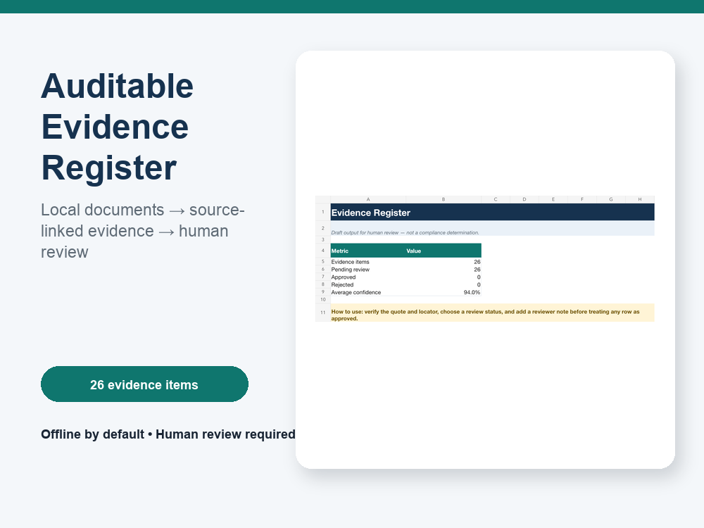
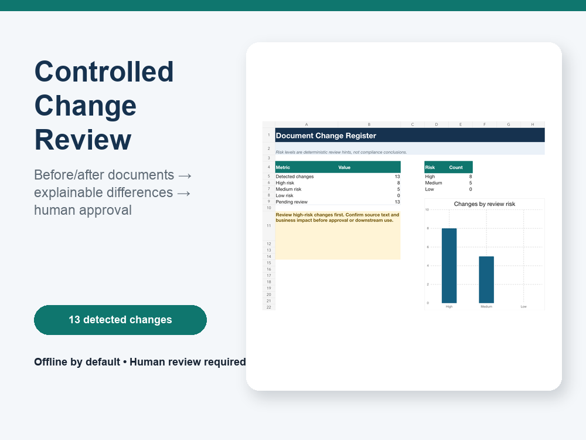

# Auditable Document Workflow Automation

[](https://github.com/zealxz/regulated-workflow-demo/actions/workflows/tests.yml)

Turn PDFs, spreadsheets, and controlled-document versions into source-linked evidence registers and review queues—local-first, with human approval.

## Seven-Day Fixed-Scope Pilot

The first two pilots are `$149` / `¥999`:

- **7 calendar days**
- **up to 20 representative documents or 500 rows**
- **one extraction, validation, or comparison workflow**
- **one structured output and one human approval point**

The pilot also includes one bounded correction round, deployment notes, and seven days of defect support. The workflow is client-owned and runs in the client's environment.

[Inspect verified sample outputs](#verified-sample-outputs) · [Watch the 30-second evidence demo](artifacts/portfolio/evidence-demo.mp4) · [Watch the 30-second change-review demo](artifacts/portfolio/changes-demo.mp4)

**Contact:** [private scoping through Upwork](https://www.upwork.com/freelancers/~017eff134da27928bc) · [public scope inquiry](https://github.com/zealxz/regulated-workflow-demo/issues/new?template=pilot-inquiry.yml) (do not include confidential data)

**Safety boundary:** only public, properly redacted, or synthetic samples are used. The pilot excludes production hosting, automatic external sending, access-control bypass, autonomous high-impact decisions, and legal, medical, financial, compliance, or approval conclusions.

## 中文服务简介

把 PDF、表格和版本文档转成带来源定位的证据台账、差异清单与人工复核队列。首两单为 7 日固定范围试点，价格 `¥999`：最多 20 份文档或 500 行、一个流程、一个结构化输出、一个人工审批点、一次限定修正和 7 天缺陷支持。演示全部使用合成数据，不冒充客户案例，不作合规结论。

[查看可下载样例](#verified-sample-outputs) · [通过 Upwork 私下沟通](https://www.upwork.com/freelancers/~017eff134da27928bc) · [公开咨询](https://github.com/zealxz/regulated-workflow-demo/issues/new?template=pilot-inquiry.yml)



[Watch the 30-second evidence demo](artifacts/portfolio/evidence-demo.mp4) · [Watch the 30-second change-review demo](artifacts/portfolio/changes-demo.mp4)



## What This Demo Proves

- `extract`: local TXT, Markdown, CSV, JSON, and optional PDF → source-linked evidence register and review queue.
- `diff`: two local snapshots → explainable old/new changes and review priority.
- Canonical JSON plus CSV, Markdown, JSONL, and formatted Excel outputs.
- Stable source IDs, hashes, explicit offline audit events, and spreadsheet-formula-injection protection.
- An optional OpenAI-compatible summary adapter that is disabled by default and receives aggregate counts only.

## Verified Sample Outputs

These downloadable artifacts were generated from the repository's synthetic fixtures. Every decision field starts as `pending`, and the committed workbooks are checked against the canonical records in CI.

| Workflow | Inspect the deliverables |
| --- | --- |
| Evidence extraction | [`evidence.xlsx`](outputs/extract/evidence.xlsx) · [`review_queue.csv`](outputs/extract/review_queue.csv) · [`audit.jsonl`](outputs/extract/audit.jsonl) · [`summary.md`](outputs/extract/summary.md) |
| Controlled change review | [`changes.xlsx`](outputs/diff/changes.xlsx) · [`review_queue.csv`](outputs/diff/review_queue.csv) · [`audit.jsonl`](outputs/diff/audit.jsonl) · [`summary.md`](outputs/diff/summary.md) |

The verifier confirms 26 evidence items and 13 changes, workbook relationships and sheets, table ranges, data validation, formulas and cached values, review defaults, and final rows.

## Quick Start: Offline Canonical Outputs

Python 3.9 or later is sufficient for TXT, Markdown, CSV, and JSON.

```bash
PYTHONPATH=src python3 -m regulated_workflow extract samples/new --output-dir outputs/extract
PYTHONPATH=src python3 -m regulated_workflow diff samples/old samples/new --output-dir outputs/diff
python3 scripts/verify_outputs.py outputs/extract outputs/diff --skip-workbooks
```

Or run both workflows:

```bash
python3 scripts/run_demo.py --skip-workbooks
```

## Full Demo With Excel Workbooks

Excel export uses Node.js 20+ and `@oai/artifact-tool` 2.8.6+. Inside Codex Desktop, use the bundled workspace dependency runtime. Outside that environment, use `--skip-workbooks` unless a compatible package is available.

```bash
python3 scripts/run_demo.py
python3 scripts/verify_outputs.py outputs/extract outputs/diff
```

Generated files:

| Workflow | Canonical | Review and presentation |
| --- | --- | --- |
| Extract | `evidence.json`, `audit.jsonl` | `evidence.xlsx`, `review_queue.csv`, `summary.md` |
| Diff | `changes.json`, `audit.jsonl` | `changes.xlsx`, `review_queue.csv`, `summary.md` |

Workbook summaries are formula-backed. Evidence and review sheets have filters, frozen headers, explicit status fields, data validation, and visible human-approval warnings.

## Direct CLI

```text
regulated-workflow extract INPUT --output-dir DIR [--llm-summary]
regulated-workflow diff OLD NEW --output-dir DIR [--llm-summary]
```

Supported inputs are `.txt`, `.md`, `.csv`, `.json`, and `.pdf`. PDF support is optional:

```bash
python3 -m pip install '.[pdf]'
```

Unsupported files inside a directory are ignored. An explicitly supplied unsupported file, malformed supported file, missing path, or unsafe output collision fails visibly with exit code `2`.

## Developer Utilities

The repository also includes a review-only lead-ranking CLI and a bounded, contact-redacted public V2EX discovery command. They are deliberately separated from the buyer-facing demo; see [`docs/acquisition-tools.md`](docs/acquisition-tools.md) for their commands, schemas, and safety boundaries.

## Optional Counts-Only LLM Draft

The network path is never enabled implicitly. `--llm-summary` requires all three environment variables:

```bash
export REGULATED_WORKFLOW_OPENAI_BASE_URL='https://provider.example/v1'
export REGULATED_WORKFLOW_OPENAI_API_KEY='set-in-your-secret-manager'
export REGULATED_WORKFLOW_OPENAI_MODEL='your-model'
```

Only aggregate document/change counts are sent. Source text, field names, values, file paths, and quotes are excluded. The remote draft remains explicitly unreviewed.

## Safety Boundaries

- Select input folders explicitly; the CLI does not scan adjacent projects.
- Use public, synthetic, or properly authorized and minimized input data.
- Treat confidence and risk as review aids, not conclusions.
- Do not connect the demo to external sending or data mutation without a separately reviewed scope.
- Keep API keys out of files, logs, screenshots, proposals, and command-line arguments.
- JSON is canonical; spreadsheets are editable presentation artifacts.

## Verification

```bash
PYTHONDONTWRITEBYTECODE=1 PYTHONPATH=src python3 -m unittest discover -s tests -v
python3 scripts/run_demo.py --skip-workbooks
python3 scripts/verify_outputs.py outputs/extract outputs/diff
```

The bounded seven-day pilot scope is documented in [`docs/service-scope.md`](docs/service-scope.md).

Ready-to-review 4:3 portfolio images and two silent 30-second H.264 demos are under [`artifacts/portfolio/`](artifacts/portfolio/). Their source hashes and output hashes are recorded in `artifacts/portfolio/manifest.json`; all visuals are derived from the verified synthetic demo run.

## License

MIT
